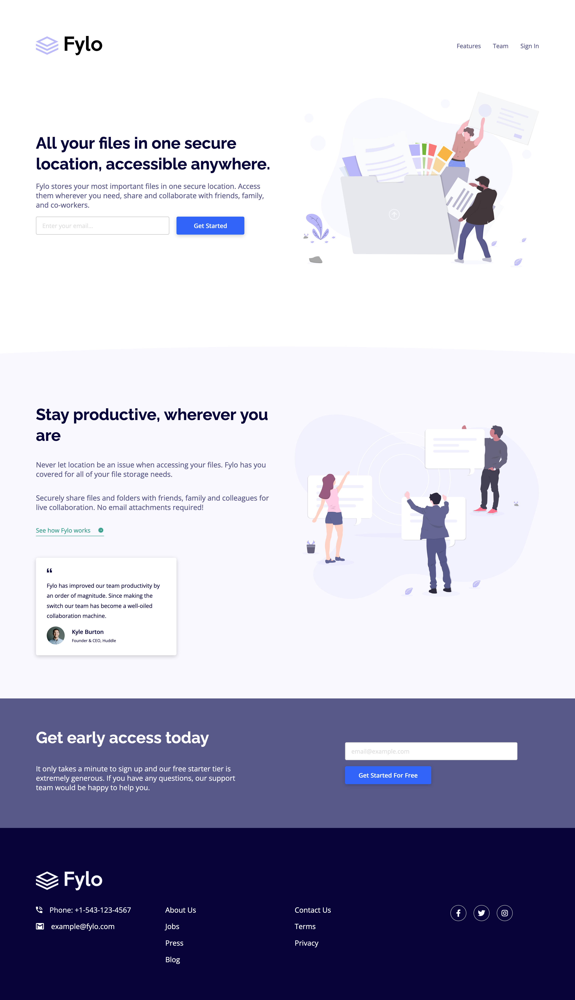

# Frontend Mentor - Fylo landing page with two column layout solution

This is a solution to the [Fylo landing page with two column layout challenge on Frontend Mentor](https://www.frontendmentor.io/challenges/fylo-landing-page-with-two-column-layout-5ca5ef041e82137ec91a50f5). Frontend Mentor challenges help you improve your coding skills by building realistic projects. 

## Table of contents

- [Overview](#overview)
  - [The challenge](#the-challenge)
  - [Screenshot](#screenshot)
  - [Links](#links)
- [My process](#my-process)
  - [Built with](#built-with)
  - [What I learned](#what-i-learned)
- [Author](#author)

## Overview

### The challenge

Users should be able to:

- View the optimal layout for the site depending on their device's screen size
- See hover states for all interactive elements on the page

### Screenshot

 

### Links

- [Solution](https://github.com/ryanthayes/fem-fylo-landing-page)
- [Live URL](https://ryanthayes.github.io/fem-fylo-landing-page)

## My process

### Built with

- Semantic HTML5 markup
- CSS custom properties
- Flexbox
- Mobile-first workflow

### What I learned

The main thing I learned on this project was simple, but was key to the final design. Initially I was trying to make the sections the containers instead of creating a div inside of the section and making it the container. Also, moving from smaller component projects to full landing pages, I learned how important comments are in HTML and not just CSS to find sections easily.

```html
<!-- hero section -->
    <section class="hero">
      
      <div class="container flex flex-column-reverse flex-gap align-items-center">
```
## Author

- Github - [@ryanthayes](https://github.com/ryanthayes)
- Frontend Mentor - [@ryanthayes](https://www.frontendmentor.io/profile/ryanthayes)
